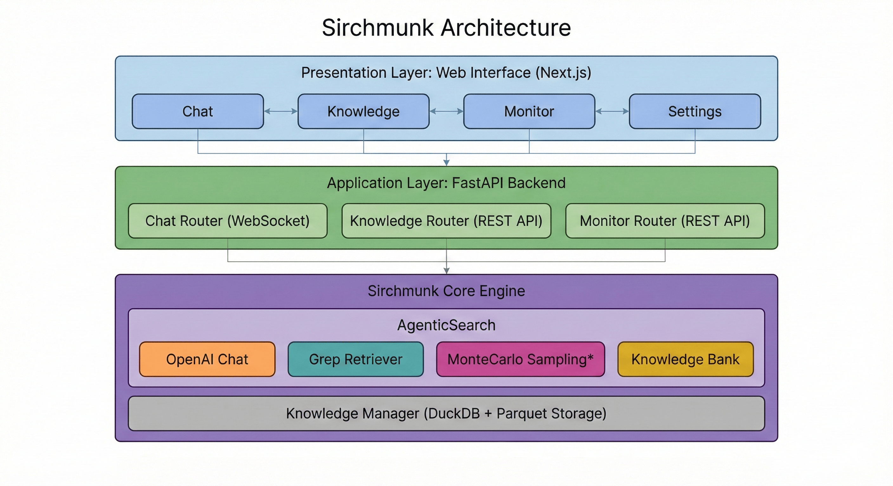
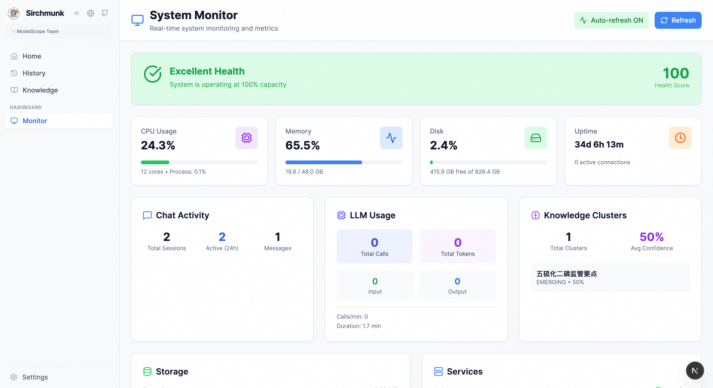

<div align="center">


# Sirchmunk: 从原始数据到自进化的实时智能

[](https://www.python.org/downloads/)
[](https://fastapi.tiangolo.com/)
[](https://nextjs.org/)
[](https://tailwindcss.com/)
[](https://duckdb.org/)
[](LICENSE)
[](https://github.com/phiresky/ripgrep-all)
[](https://github.com/openai/openai-python)
[](https://ollama.com/)
[](https://github.com/zalando/kreuzberg)

<p align="center">
  <b>实时搜索、推理与知识演化。</b>
</p>

[**快速开始**](#-快速开始) · [**架构设计**](#-架构设计) · [**核心模块**](#-核心模块) · [**API 参考**](#-api-参考) · [**常见问题**](#-常见问题)

[🇺🇸 English](README.md)

</div>

<div align="center">

🔍 **智能搜索** &nbsp;•&nbsp; 🧠 **知识聚类** &nbsp;•&nbsp; 📊 **蒙特卡洛证据采样**<br>
⚡ **免索引检索** &nbsp;•&nbsp; 🔄 **自进化知识库** &nbsp;•&nbsp; 💬 **实时对话**

</div>

---

## 🌰 “Sirchmunk” 的含义

**Sirchmunk** 由 **Search** 与 **Chipmunk** 融合而来：快速、灵活、擅长在庞杂数据中精准挖掘价值信号。

Logo象征：

- **动作迅捷**：无需向量数据库与耗时索引，即刻检索  
- **不挑食**：可处理 PDF、代码、Markdown、日志等复杂文档  
- **轻量设计**：依赖极简，易部署  
- **环境适应能力强**：知识可持续自我进化  

---

## ✨ 核心特性

### 🔍 智能搜索引擎与多级关键词提取

- **智能查询理解**：LLM 驱动的关键词提取，支持可配置的粒度级别（粗粒度 → 细粒度）
- **优先命中检索**：按关键词级别顺序搜索，首次命中即停止，实现最优效率
- **TF-IDF 评分**：先进的文档排序算法，支持自定义权重

### 🧠 自进化知识聚类

- **自动知识结构化**：将原始搜索结果转换为结构化的 `KnowledgeCluster` 对象
- **基于证据的学习**：蒙特卡洛采样识别相关区域，结合 LLM 评估
- **生命周期管理**：跟踪知识状态（`STABLE`、`EMERGING`、`CONTESTED`、`DEPRECATED`）
- **持久化存储**：DuckDB + Parquet 实现高效的知识持久化和检索
- **动态知识生成**：知识聚类随搜索模式持续构建与更新

### 📚 大规模文档理解

- **海量覆盖**：无需预索引即可处理大型仓库
- **精细化证据定位**：从超长文档中抽取并评分关键片段
- **多级召回增强**：粗到细关键词分层提升长文与噪声语料命中率

### ⚡ 免索引实时检索

- **无需预索引**：基于 `grep` 的直接检索
- **多格式支持**：PDF、DOCX、TXT、Markdown、代码文件等
- **极速搜索**：可配置并发的并行文件扫描

### 💬 交互式对话界面

- **WebSocket 流式传输**：实时响应流，搜索日志可视化
- **RAG 集成**：无缝的知识库增强生成
- **会话管理**：基于 DuckDB 的持久化聊天历史
- **LLM 用量追踪**：实时 Token 消耗监控

### 📊 全面的监控仪表板

- **系统指标**：CPU、内存、磁盘使用率监控
- **对话分析**：会话统计和活动监控
- **知识分析**：知识聚类的 BI 风格可视化
- **LLM 使用统计**：按模型统计 Token 消耗

---

## 🏗️ 架构设计

<div align="center">
  
</div>

### 核心组件

| 组件 | 描述 |
|:---|:---|
| **AgenticSearch** | 主搜索协调器，具有 LLM 驱动的关键词提取和检索功能 |
| **KnowledgeBank** | 将原始结果转换为结构化知识聚类，包含证据采样 |
| **KnowledgeManager** | 使用 DuckDB 和 Parquet 格式的持久化存储层 |
| **GrepRetriever** | 高性能免索引文件搜索，支持并行处理 |
| **OpenAIChat** | 统一的 LLM 接口，支持流式传输和用量追踪 |
| **MonitorTracker** | 实时系统和应用指标收集 |

---

## 🚀 快速开始

### 前置条件

- **Python** 3.10+
- **Node.js** 18+（用于 Web 界面）
- **LLM API Key**（OpenAI 兼容端点）

### 步骤 1：克隆与配置

```bash
# 克隆仓库
git clone https://github.com/modelscope/sirchmunk.git
cd sirchmunk

# 创建环境文件
cp .env.example .env
# 编辑 .env 填入您的 LLM API 凭证
```

<details>
<summary>📋 <b>环境变量参考</b></summary>

| 变量 | 必需 | 描述 |
|:---|:---:|:---|
| `LLM_BASE_URL` | **是** | LLM API 端点（例如 `https://api.openai.com/v1`） |
| `LLM_API_KEY` | **是** | 您的 LLM API 密钥 |
| `LLM_MODEL_NAME` | **是** | 模型名称（例如 `gpt-4o`、`gpt-4o-mini`） |
| `WORK_PATH` | 否 | 数据存储工作目录（默认：当前目录） |
| `GREP_CONCURRENT_LIMIT` | 否 | 并行 grep 工作线程数（默认：`10`） |

</details>

### 步骤 2：安装依赖

```bash
# 创建虚拟环境（推荐）
conda create -n sirchmunk python=3.10 && conda activate sirchmunk
# 或：python -m venv venv && source venv/bin/activate

# 安装 Python 依赖
pip install -r requirements.txt

# 安装 Web 依赖
npm install --prefix web
```

### 步骤 3：启动

```bash
# 同时启动后端和前端
python scripts/start_web.py

# 或分别启动：
# 后端：python src/api/run_server.py
# 前端：cd web && npm run dev
```

### 访问地址

| 服务 | URL | 描述 |
|:---:|:---|:---|
| **Web 界面** | http://localhost:3000 | 主对话和仪表板 |
| **API 文档** | http://localhost:8000/docs | 交互式 Swagger UI |

---

## 🖥️ Web 界面

Web UI 面向快速、透明的工作流：对话、知识分析与系统监控集中呈现。

<div align="center">
  
  <p><sub>主页 — 流式对话日志、基于文件的 RAG、会话管理。</sub></p>
</div>

<div align="center">
  
  <p><sub>监控 — 系统健康、对话活动、知识分析与 LLM 用量。</sub></p>
</div>

---

## 📦 核心模块

<details>
<summary><b>🔍 AgenticSearch</b></summary>

> **智能搜索引擎**，具有多级关键词提取、优先命中检索和自动知识聚类功能。

**核心特性**

| 特性 | 描述 |
|:---:|:---|
| 多级关键词 | 可配置粒度级别（1-N）的关键词提取 |
| 优先命中搜索 | 任意级别找到结果即停止搜索 |
| TF-IDF 评分 | 带长度惩罚的先进文档排序 |
| 知识持久化 | 自动将搜索结果保存为 KnowledgeCluster 对象 |

**Python API**

```python
import asyncio
from sirchmunk import AgenticSearch

async def main():
    search = AgenticSearch()
    
    result = await search.search(
        query="Transformer 注意力机制是如何工作的？",
        search_paths=["/path/to/documents"],
        keyword_levels=3,  # 粗粒度 → 中粒度 → 细粒度
        top_k_files=5,
        max_depth=10
    )
    
    print(result)

asyncio.run(main())
```

</details>

---

<details>
<summary><b>🧠 KnowledgeBank</b></summary>

> **证据处理器**，使用蒙特卡洛采样和 LLM 评估将原始搜索结果转换为结构化知识聚类。

**核心特性**

| 特性 | 描述 |
|:---:|:---|
| 蒙特卡洛采样 | 通过迭代采样识别大型文档中的相关区域 |
| LLM 证据评估 | 带推理的证据片段评分和验证 |
| 模糊锚定 | 基于 RapidFuzz 的预过滤，实现高效采样 |
| 结构化输出 | 生成包含证据、模式和约束的 KnowledgeCluster |

**知识聚类 Schema**

```python
@dataclass
class KnowledgeCluster:
    id: str
    name: str
    description: List[str]
    content: Union[str, List[str]]
    evidences: List[EvidenceUnit]
    patterns: List[str]
    constraints: List[Constraint]
    confidence: float
    abstraction_level: AbstractionLevel
    lifecycle: Lifecycle  # STABLE, EMERGING, CONTESTED, DEPRECATED
    hotness: float
    search_results: List[str]
```

</details>

---

<details>
<summary><b>💾 KnowledgeManager</b></summary>

> **使用 DuckDB 和 Parquet 格式的知识聚类持久化存储层**。

**核心特性**

| 特性 | 描述 |
|:---:|:---|
| CRUD 操作 | 完整的增删改查支持 |
| 模糊搜索 | 按名称、描述或内容查找聚类 |
| 合并与拆分 | 合并或拆分知识聚类 |
| 统计信息 | 获取分析和分布指标 |

**Python API**

```python
from sirchmunk.storage import KnowledgeManager

# 初始化管理器
km = KnowledgeManager(work_path="/path/to/workspace")

# 插入聚类
await km.insert(cluster)

# 搜索聚类
results = await km.find("transformer attention")

# 获取统计信息
stats = km.get_stats()
print(f"聚类总数: {stats['custom_stats']['total_clusters']}")
```

**存储位置**

```
{WORK_PATH}/
└── .cache/
    └── knowledge/
        └── knowledge_clusters.parquet
```

</details>

---

<details>
<summary><b>⚡ GrepRetriever</b></summary>

> **高性能免索引检索器**，使用并行 grep 实现实时文件搜索。

**核心特性**

| 特性 | 描述 |
|:---:|:---|
| 并行处理 | 可配置并发工作线程 |
| 多格式支持 | PDF、DOCX、TXT、MD、代码文件等 |
| 正则支持 | 支持完整正则表达式匹配 |
| 结果合并 | 跨文件去重并合并结果 |

**支持的文件类型**

- 文档：PDF、DOCX、TXT、Markdown
- 代码：Python、JavaScript、TypeScript、Java、Go、Rust、C/C++
- 数据：JSON、YAML、XML、CSV
- 压缩包：ZIP、TAR（自动解压）

</details>

---

<details>
<summary><b>💬 Chat API</b></summary>

> **基于 WebSocket 的对话接口**，支持 RAG 集成与实时流式输出。

**对话模式**

| 模式 | 描述 |
|:---:|:---|
| 纯对话 | 不进行检索的 LLM 直连对话 |
| 对话 + RAG | 基于本地文件的知识增强生成 |
| 对话 + Web | Web 搜索增强（即将上线） |
| 对话 + RAG + Web | 本地知识与 Web 搜索结合 |

**WebSocket 消息格式**

```json
{
  "type": "message",
  "content": "Your question here",
  "session_id": "uuid",
  "enable_rag": true,
  "kb_name": "/path/to/documents"
}
```

**响应类型**

```json
// Streaming content
{"type": "content", "content": "..."}

// Search logs
{"type": "search_log", "level": "info", "message": "...", "is_streaming": false}

// Status updates
{"type": "status", "stage": "generating", "message": "..."}

// Completion
{"type": "done", "message_id": "uuid", "sources": {...}}
```

</details>

---

## 📂 数据存储

所有持久化数据存储在配置的 `WORK_PATH` 中：

```
{WORK_PATH}/
├── .cache/
│   ├── history/              # 对话历史（DuckDB）
│   │   └── chat_history.db
│   ├── knowledge/            # 知识聚类（Parquet）
│   │   └── knowledge_clusters.parquet
│   └── settings/             # 用户设置（DuckDB）
│       └── settings.db
└── logs/                     # 应用日志
```

---

## 🔧 API 参考

### REST 端点

| 端点 | 方法 | 描述 |
|:---|:---:|:---|
| `/api/v1/chat/sessions` | GET | 获取所有会话 |
| `/api/v1/chat/session/{id}` | GET | 获取会话详情 |
| `/api/v1/chat/ws` | WS | WebSocket 对话端点 |
| `/api/v1/knowledge/list` | GET | 获取知识聚类列表 |
| `/api/v1/knowledge/stats` | GET | 获取知识统计 |
| `/api/v1/knowledge/search` | POST | 搜索知识聚类 |
| `/api/v1/monitor/overview` | GET | 获取系统概览 |
| `/api/v1/monitor/llm` | GET | 获取 LLM 用量统计 |
| `/api/v1/settings` | GET/POST | 管理设置 |

### Python SDK

```python
from sirchmunk import AgenticSearch
from sirchmunk.llm import OpenAIChat
from sirchmunk.storage import KnowledgeManager

# 使用自定义 LLM 初始化
llm = OpenAIChat(
    base_url="https://api.openai.com/v1",
    api_key="your-key",
    model="gpt-4o"
)

search = AgenticSearch(llm=llm)
result = await search.search(query="...", search_paths=["..."])
```

---

## ❓ 常见问题

<details>
<summary><b>这与传统 RAG 系统有什么不同？</b></summary>

Sirchmunk 采用**免索引方法**：

1. **无需预索引**：无需向量数据库设置的直接文件搜索
2. **自进化**：知识聚类根据搜索模式演进
3. **多级检索**：自适应关键词粒度提升召回
4. **基于证据**：蒙特卡洛采样实现精确内容提取

</details>

<details>
<summary><b>支持哪些 LLM 提供商？</b></summary>

任何 OpenAI 兼容的 API 端点，包括：
- OpenAI（GPT-4、GPT-4o、GPT-3.5）
- Azure OpenAI
- 通过 Ollama、vLLM 或 LM Studio 的本地模型
- 通过 API 代理的 Claude

</details>

<details>
<summary><b>如何添加要搜索的文档？</b></summary>

只需在搜索时指定路径：

```python
result = await search.search(
    query="Your question",
    search_paths=["/path/to/folder", "/path/to/file.pdf"]
)
```

无需预处理或索引！

</details>

<details>
<summary><b>知识聚类存储在哪里？</b></summary>

知识聚类以 Parquet 格式持久化存储在：
```
{WORK_PATH}/.cache/knowledge/knowledge_clusters.parquet
```

您可以使用 DuckDB 或 `KnowledgeManager` API 查询。

</details>

<details>
<summary><b>如何监控 LLM Token 使用量？</b></summary>

1. **Web 仪表板**：进入 Monitor 页面查看实时统计
2. **API**：`GET /api/v1/monitor/llm` 返回用量指标
3. **代码**：搜索完成后访问 `search.llm_usages`

</details>

---

## 📋 路线图

- [x] 多级关键词提取
- [x] 知识结构化表示与持久化
- [x] RAG 实时对话
- [x] 支持Web UI
- [x] 系统监控仪表板
- [ ] 多模态支持（图片、视频等）
- [ ] Web 搜索集成
- [ ] 知识可视化和深度分析
- [ ] 更多文件类型的支持

---

## 🤝 贡献

欢迎贡献！请查看 [贡献指南](CONTRIBUTING.md)。

```bash
# 开发环境设置
pip install -r requirements/tests.txt
pytest tests/
```

---

## 📄 许可证

本项目采用 [Apache License 2.0](LICENSE) 许可证。

---

## Star History

[](https://star-history.com/#modelscope/sirchmunk&Date)


---

<div align="center">

**[ModelScope](https://github.com/modelscope)** · [⭐ Star 我们](https://github.com/modelscope/sirchmunk/stargazers) · [🐛 报告问题](https://github.com/modelscope/sirchmunk/issues) · [💬 讨论](https://github.com/modelscope/sirchmunk/discussions)

*✨ Sirchmunk：从原始数据到自进化的实时智能。*

</div>

<p align="center">
  <em> ❤️ Thanks for Visiting ✨ Sirchmunk !</em><br><br>
  
</p>
